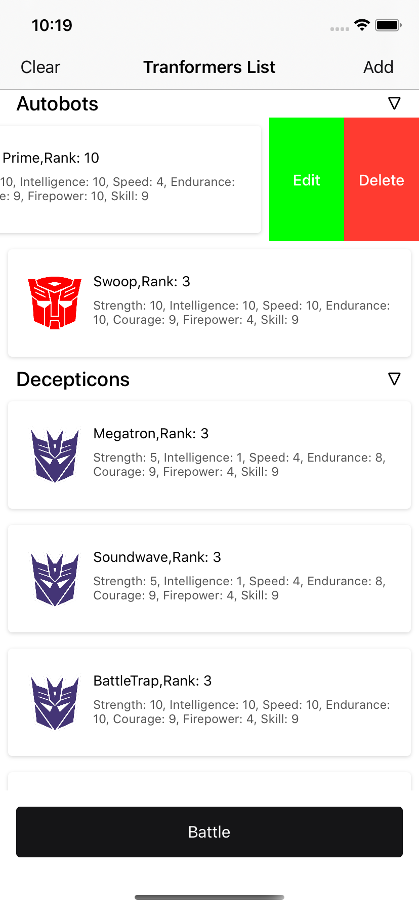

# TransformerApp
A project shows a list of Transformers, Where the user can add, edit, delete transformers and also it shows us Battle between two teams Autobots and Decepticons, from which winner is decided and also shows survivors.

# Application Screenshots

# Requirement
- iOS 10.0+
- Xcode 11.7

# Installation
- To run the project :
- Open podfile from project repository 
- Open terminal and cd to the directory containing the Podfile
- Run the "pod install" command
- Open TransformerApp.xcworkspace 

# Language 
Swift 5.0

# Version
1.0 

# Design Pattern Used
## MVVM
Model-View-ViewModel (MVVM) is a structural design pattern that separates objects into three distinct groups:

__View:__ Display visual elements and controls on the screen. In iOS View layer is represented by View and ViewController.

__ViewModel:__ Transform model information into values that can be displayed on a view. It interacts with the DataManager layer to retrieve the data. This layer will notify the changes in data to the View layer using completion handler.

__NetworkManger:__ This class interacts remotely. It retrieves the data from the server and map into the model.

__Model:__ hold application data. 

# Features
## Transformer List
- This shows list of transformers from diffrent teams

## Add, Edit and Delete
- User can add, edit and delete any of transformer. Addition and deletion contain these fields:-
● Strength
● Intelligence
● Speed
● Endurance
● Rank
● Courage
● Firepower
● Skill
● Team

## Battle
- This shows the battle between different transformers which are sorted by rank and tells us who wins on following rules:-
● The teams should be sorted by rank and faced off one on one against each other in order to determine a victor, the loser is eliminated
● A battle between opponents uses the following rules:
● If any fighter is down 4 or more points of courage and 3 or more points of strength
compared to their opponent, the opponent automatically wins the face-off regardless of
overall rating (opponent has ran away)
● Otherwise, if one of the fighters is 3 or more points of skill above their opponent, they win
the fight regardless of overall rating
● The winner is the Transformer with the highest overall rating
● In the event of a tie, both Transformers are considered destroyed
● Any Transformers who don’t have a fight are skipped (i.e. if it’s a team of 2 vs. a team of 1,
there’s only going to be one battle)
● The team who eliminated the largest number of the opposing team is the winner
● Any Transformer named Optimus Prime or Predaking wins his fight automatically regardless of any other criteria
● In the event either of the above face each other (or a duplicate of each other), the game immediately ends with all competitors destroyed

## Survivor
This shows a list of transformer who survived from battle.

# Assumptions        
-   The app is designed for iPhones only.        
-   App support english language.
-   Mobile platform supported: iOS (10.x11.x, 12.x,13.x)        
-   Device support - iPhone 5s, iPhone 6 Series, iPhone SE, iPhone 7 Series, iPhone 8 Series, iPhone X Series    
-   iPhone app support would be limited to portrait mode.

# Unit Testing
- Unit testing is done by using XCTest.

# (CocoaPods/Libraries) Used     
- Kingfisher (Image Caching)
- SwiftLint (Formatting Code)
- SVProgressHUD (Showing Loader)
- IQKeyboardManager (Handling keyboard)

# Linting
## SwiftLint
- Integration of   [SwiftLint][https://github.com/realm/SwiftLint] into an Xcode scheme to keep a codebase consistent and maintainable .
- Install the swiftLint via cocoaPod and need to add a new "Run Script Phase" with:
"${PODS_ROOT}/SwiftLint/swiftlint"
- .swiftlint.yml file is used for basic set of rules . It is placed inside the project folder.

# Improvements
-  UI Testing could be implemented.
-  Real time data syncing and data caching could be implemented.

# References
[a ChawlaBhavuk/DeliveryApp](https://github.com/ChawlaBhavuk/DeliveryApp)
[a mobikul/BhavukChawla](https://mobikul.com/create-expandable-table-view-swift/)

# License
## MIT License

### Copyright (c) 2019 

Permission is hereby granted, free of charge, to any person obtaining a copy
of this software and associated documentation files (the "Software"), to deal
in the Software without restriction, including without limitation the rights
to use, copy, modify, merge, publish, distribute, sublicense, and/or sell
copies of the Software, and to permit persons to whom the Software is
furnished to do so, subject to the following conditions:

The above copyright notice and this permission notice shall be included in all
copies or substantial portions of the Software.

THE SOFTWARE IS PROVIDED "AS IS", WITHOUT WARRANTY OF ANY KIND, EXPRESS OR
IMPLIED, INCLUDING BUT NOT LIMITED TO THE WARRANTIES OF MERCHANTABILITY,
FITNESS FOR A PARTICULAR PURPOSE AND NONINFRINGEMENT. IN NO EVENT SHALL THE
AUTHORS OR COPYRIGHT HOLDERS BE LIABLE FOR ANY CLAIM, DAMAGES OR OTHER
LIABILITY, WHETHER IN AN ACTION OF CONTRACT, TORT OR OTHERWISE, ARISING FROM,
OUT OF OR IN CONNECTION WITH THE SOFTWARE OR THE USE OR OTHER DEALINGS IN THE
SOFTWARE.

